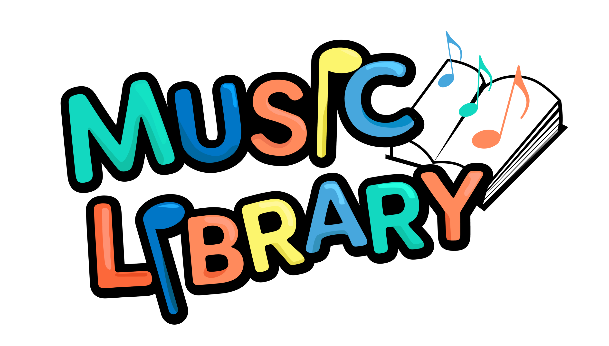

# Music Library App (CSC 335 LA1)
* [![Java][Java]][Java-url]
* [![IntelliJ IDEA][IntelliJ]][IntelliJ-url]

<p align="right">(<a href="#readme-top">back to top</a>)</p>

Welcome to the **Music Library App**! This console-based Java application allows you to manage a music library, search for songs/albums, create playlists, rate songs, and maintain a list of favorites. It is a project for **CSC 335 LA1**, taught by **Instructor Malenie Lotz** with the assistance of **TA Jenny Yu**. The authors of this project are **[Haocheng Cao](https://github.com/Boldthinkingcat)** and **[Minglai Yang](https://ymingl.com)**. This project will be open-source after the grades released.



---

## Table of Contents
1. [Overview](#overview)
2. [Features](#features)
3. [Project Structure](#project-structure)
4. [Getting Started](#getting-started)
5. [How to Use](#how-to-use)
6. [Sample Flow](#sample-flow)
7. [Author & Acknowledgments](#author--acknowledgments)
8. [License](#license)

---

## Overview

The **Music Library App** is a simple command-line interface (CLI) program that simulates the functionalities of managing music data:

- **Search and load songs** from a "Store" into a local user library.
- **View and handle albums** within the store or user library.
- **Create and manage playlists**, add or remove songs, and play them.
- **Rate songs** and mark them as favorites.
- **View your entire library** of songs, albums, artists, and more.

This project helps students practice object-oriented programming (OOP) concepts and Java coding skills by simulating a real-world application with menus, data manipulation, and user interactions.

---

## Features

1. **Song Management**
    - Input/load song details manually into the library.
    - Search for songs by title or artist (in both Store and User Library).
    - View song details (title, artist, genre, year, rating, and whether it is a favorite).

2. **Album Management**
    - Search for albums by album title or artist.
    - Load entire albums from the Store into the user library.
    - View album info and associated tracks.

3. **Library Management**
    - View all songs, albums, and artists in the user library.
    - Organize songs into multiple playlists.
    - Mark/unmark songs as favorites.

4. **Playlists**
    - Create new playlists, open existing ones, and add/remove songs.
    - Shuffle or play an entire playlist.

5. **Favorites**
    - Maintain a dedicated “Favorite List.”
    - Easily add/remove songs to/from the favorites.
    - Play songs directly from the favorites list.

6. **Song Rating System**
    - Rate songs on a scale of 1–5.
    - Automatically add songs rated 5 stars to Favorites.

---

## Project Structure
```
la1/
├── MainUI.java         // The main class containing the CLI flow (menus, input, etc.)
├── MusicStore.java     // Manages store-related data (songs, albums available to load)
├── LibraryModel.java   // Core logic for the user’s library, playlists, favorites, rating
├── Song.java           // Represents a single Song entity
├── Album.java          // Represents an Album entity containing multiple songs
├── TablePrinter.java   // Utility class for printing tables in the console
├── Genre.java		// ENUM for different genre
├── Rating.java		// ENUM for rating: 1-5 only
├── Playlist.java	// Represents a Playlist entity having a name and a list of Songs
├── PlayingList.java	// Extend from Playlist, for only a list of queueing songs
├── Playlists.java	// A Hashmap with key and matching playlist
└── FavoriteList.java	// Represents a Playlist for saving user's favorite songs
```
- **MainUI**  
  Contains all the user interface logic and menu navigation in a console environment.

- **MusicStore**  
  Manages a collection of available songs/albums that can be loaded into the user library.

- **LibraryModel**  
  Core business logic and data handling for user’s library, playlists, favorites, and ratings.

- **Song** / **Album**  
  Data model classes representing individual songs and albums.

- **TablePrinter**  
  Utility class used for formatting and printing lists of data in a table-like structure to the console.

---

## Getting Started

### Prerequisites
- **Java 8** or higher.
- A Java-compatible IDE (e.g., IntelliJ, Eclipse, VS Code) or the ability to compile via the command line. We use IntelliJ for this project!!

### Installation & Compilation
1. Clone or download this repository:
   ```bash
   git clone https://github.com/mlyann/music-store.git
   ```
2.	Open the project in your preferred IDE or navigate into the project folder via terminal:
```bash
cd music-store
```
3.	Ensure that the package structure (la1) is respected if you are using an IDE.
4.	Compile the code (if using command line):
```bash
javac la1/*.java
```
5.	Running the Application
After compilation, run the main application class:
```bash
java la1.MainUI
```
---

## Features

1. **Song Management**  
   - Input/load song details manually into the library.  
   - Search for songs by title or artist (in both Store and User Library).  
   - View song details (title, artist, genre, year, rating, and whether it is a favorite).

2. **Album Management**  
   - Search for albums by album title or artist.  
   - Load entire albums from the Store into the user library.  
   - View album info and associated tracks.

3. **Library Management**  
   - View all songs, albums, and artists in the user library.  
   - Organize songs into multiple playlists.  
   - Mark/unmark songs as favorites.

4. **Playlists**  
   - Create new playlists, open existing ones, and add/remove songs.  
   - Shuffle or play an entire playlist.

5. **Favorites**  
   - Maintain a dedicated “Favorite List.”  
   - Easily add/remove songs to/from the favorites.  
   - Play songs directly from the favorites list.

6. **Song Rating System**  
   - Rate songs on a scale of 1–5.  
   - Automatically add songs rated 5 stars to Favorites.

---

## Sample Flow

Below is a brief example of how a typical session might proceed in the console:

1. **Main Menu**  
   - Simply type the corresponding number (e.g., `1`, `2`, `3`, `4`, `5`, `6`, or `0`) to navigate through the menu.

2. **Search for Coldplay Songs Example**  
```
======================================================
    🎶 Welcome to the Music Library App (CSC 335) 🎶   
         📅 Date: Feb 21, 2025
    👥 Authors: Haocheng Cao & Minglai Yang
======================================================

---------- 🎵 MAIN MENU 🎵 ----------
1) 🔍 Search
2) 🎧 PlayingList
3) 📝 View all PlayLists
4) ❤️ Favorite List
5) 🏠 Library Lists
6) ➕ Load Songs single
0) 🚪 Quit the application
👉 Enter your choice: 1

---------- 🔍 Search MENU 🔍 ----------

Where would you like to search?
1) 🏪 Music Store
2) 🏠 User Library
0) 🔙 Back to Main Menu
👉 Enter choice: 1

What would you like to search?
1) 🎤 Search for songs
2) 🎼 Search for albums
0) 🔙 Back to Search Menu
h) 🚪 Back to Main Menu
👉 Enter choice: 1

--- 🎤 Searching for Songs ---
🔎 Enter song title or artist keyword  
0) 🔙 Back to search menu: 
h) 🚪 Back to Main Menu
👉 Enter choice: coldplay

Found 11 matching song(s):
```
Here we also print the song as a table, so the users can add/rate these songs simply by enter the number.
```
===================================================
           🎉 Search Results (Songs) 🎉              
===================================================
+-----+--------------------------------+----------+-------+------+-----------------------------+
| No. | Title                          | Artist   | Genre | Year | Album                       |
+-----+--------------------------------+----------+-------+------+-----------------------------+
| 1   | A Rush of Blood to the Head    | Coldplay | Other | 2002 | A Rush of Blood to the Head |
| 2   | Daylight                       | Coldplay | Other | 2002 | A Rush of Blood to the Head |
| 3   | Warning Sign                   | Coldplay | Other | 2002 | A Rush of Blood to the Head |
| 4   | Politik                        | Coldplay | Other | 2002 | A Rush of Blood to the Head |
| 5   | A Whisper                      | Coldplay | Other | 2002 | A Rush of Blood to the Head |
| 6   | Amsterdam                      | Coldplay | Other | 2002 | A Rush of Blood to the Head |
| 7   | God Put a Smile Upon Your Face | Coldplay | Other | 2002 | A Rush of Blood to the Head |
| 8   | Green Eyes                     | Coldplay | Other | 2002 | A Rush of Blood to the Head |
| 9   | In My Place                    | Coldplay | Other | 2002 | A Rush of Blood to the Head |
| 10  | Clocks                         | Coldplay | Other | 2002 | A Rush of Blood to the Head |
| 11  | The Scientist                  | Coldplay | Other | 2002 | A Rush of Blood to the Head |
+-----+--------------------------------+----------+-------+------+-----------------------------+

Which song would you like add to library?
1) All songs
2) Select single song
0) 🔙 Back to song search
h) 🚪 Back to Main Menu
👉 Enter choice:
.....
```

## Author & Acknowledgments
1. **Authors**:
 - [Haocheng Cao](https://github.com/Boldthinkingcat)
 - [Minglai Yang](https://ymingl.com/)
2. **Mentors**:
 - Instructor: [Malenie Lotz](https://www.cs.arizona.edu/person/melanie-lotz) (CSC 335)
 - Teaching Assistant: Jenny Yu

We deeply appreciate the guidance and support of our instructor Malenie Lotz and TA Jenny Yu throughout this journey. 😊 

## License
This project is licensed under the MIT License. We warmly welcome collaboration on our project! If you have any questions, please feel free to contact us at haochengcao2003@gmail.com or millermlyang@gmail.com.

<!-- PROJECT LINKS -->
[contributors-shield]: https://img.shields.io/github/contributors/mlyann/music-store.svg?style=for-the-badge
[contributors-url]: https://github.com/mlyann/music-store/graphs/contributors
[forks-shield]: https://img.shields.io/github/forks/mlyann/music-store.svg?style=for-the-badge
[forks-url]: https://github.com/mlyann/music-store/network/members
[stars-shield]: https://img.shields.io/github/stars/mlyann/music-store.svg?style=for-the-badge
[stars-url]: https://github.com/mlyann/music-store/stargazers
[issues-shield]: https://img.shields.io/github/issues/mlyann/music-store.svg?style=for-the-badge
[issues-url]: https://github.com/mlyann/music-store/issues
[license-shield]: https://img.shields.io/github/license/mlyann/music-store.svg?style=for-the-badge
[license-url]: https://github.com/mlyann/music-store/blob/main/LICENSE


<!-- BADGE LINKS -->
[Java]: https://img.shields.io/badge/Java-ED8B00?style=for-the-badge&logo=java&logoColor=white
[Java-url]: https://www.java.com/
[IntelliJ]: https://img.shields.io/badge/IntelliJ-000000?style=for-the-badge&logo=intellij-idea&logoColor=white
[IntelliJ-url]: https://www.jetbrains.com/idea/
